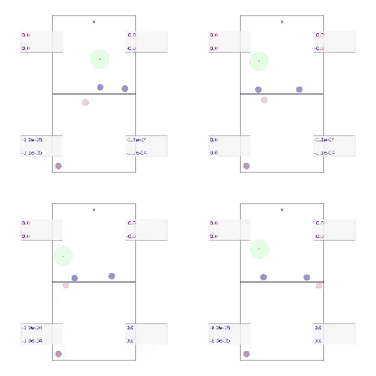
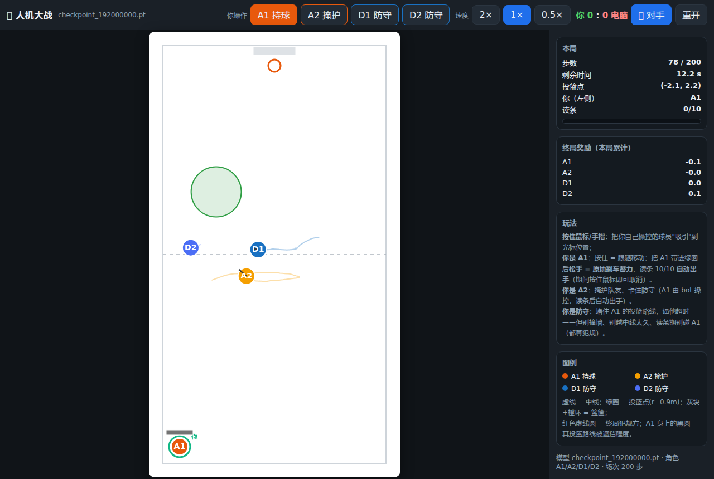

# RoboCon 2025 · 篮球上篮 2v2 多智能体强化学习

> 让两个进攻者（持球人 A1 + 掩护者 A2）在 2v2 对抗中学会**跑位、掩护、卡位、读条蓄力出手**，
> 让两个防守者学会**站位、延误、封盖、不犯规**。
> 环境是自研的 `vmas/layup` 场景，训练框架是深度定制过的 **BenchMARL**（TorchRL）单组自对弈 MAPPO。



*上图：从 `checkpoint_192000000.pt`（iter 640）的异步评测回放里抽出的 5 局连续画面（180 帧 ≈ 6 秒）。
橙=A1 持球，黄=A2 掩护，蓝=D1/D2 防守；绿色圆 = 投篮点（R=0.9 m，随机），灰条 = 篮筐；
A1 身上的半透明黑圆 = "出手通道被遮挡程度"（`a1_block_factor`），红色虚线圆 = 终局被判罚的肇事者。*

---

## 目录

1. [项目概览](#1-项目概览)
2. [仓库结构与子模块](#2-仓库结构与子模块)
3. [快速开始](#3-快速开始)
4. [环境设计：`vmas/layup`](#4-环境设计vmaslayup)
5. [算法与模型](#5-算法与模型)
6. [训练工程与踩坑记录](#6-训练工程与踩坑记录)
7. [实验历史与关键数据](#7-实验历史与关键数据)
8. [工具链](#8-工具链)
9. [常见问题（FAQ）](#9-常见问题faq)
10. [当前开放问题](#10-当前开放问题)

---

## 1. 项目概览

### 1.1 目标

RoboCon 2025 的篮球上篮对抗场景：一套**竞争性多智能体强化学习**（MARL）系统，同一套策略权重
同时驱动攻守四方，通过自对弈（self-play）让"投篮得分"与"防守成功"两类行为在对抗中共同进化，
最终希望涌现出**非脚本化的战术行为**（掩护、卡位、延误、拉杆、造犯规等）。

### 1.2 一句话架构

```
VMAS（自研 layup 场景 + JIT 奖励）  ──►  BenchMARL（单组 MAPPO / Attention+GRU / 角色条件化）
        ▲                                          │
        │                                          ▼
   人机大战 / 观察窗（浏览器）  ◄──  异步评测 worker（CPU 出视频 + 曲线）
```

- 环境侧：`VectorizedMultiAgentSimulator/vmas/scenarios/layup.py`（场景 + 观测 + 渲染）
  与 `layup_jit.py`（纯张量化的奖励 / 终止 / 判罚）。
- 训练侧：`BenchMARL/benchmarl/**`（TorchRL 封装）、`BenchMARL/clear_restore.py`（唯一训练入口）。
- 工具侧：`BenchMARL/liveview/`（实时观察窗）、`BenchMARL/human_game/`（人机大战）、`.opencode/`（取证与验收脚本）。

### 1.3 关键特性速览

| 特性 | 说明 |
|---|---|
| **混合动作空间** | A1 = 2 维连续速度 + 1 维离散"按住读条"键（action mask 门控）；A2/D1/D2 = 2 维连续（适配层补 0） |
| **按键式投篮** | 圈内按住 → 刹车 → 读条 10 帧满自动出手；松手/出圈清零；防守可在读条期补救 |
| **单组自对弈** | 四方同组、共享主干、按角色（role_id）条件化输出，不再分 attacker/defender 两组与课程 |
| **角色条件化网络** | Attention + GRU 主干 + role embedding + 逐层 FiLM + per-role 输出头（含 `role_out_dims` 不等宽输出） |
| **感知噪声** | 相对/绝对位置与速度按距离注入高斯噪声（本体感受、投篮点、全局 state 不加噪） |
| **篮球式判罚** | 碰撞按"接近分量"对称判责 + 防守方非法移动豁免；读条期触碰 A1 绝对判防守犯规 |
| **实时观察窗** | 浏览器三合一面板：单局回放（含终局码、肇事者、封盖遮挡）、胜率/各码占比曲线、训练日志 |
| **人机大战** | 浏览器里手动操控任意一名球员与策略对打/合作（按住吸引、松手刹车蓄力） |

---

## 2. 仓库结构与子模块

```
robocon2025_marl_devcontainer/           # 父仓库（环境 + 文档 + 工具脚本）
├── BenchMARL/                           # forked 子模块（训练框架，重度定制）
├── VectorizedMultiAgentSimulator/       # forked 子模块（VMAS 模拟器，重度定制）
├── .devcontainer/                       # Dockerfile + devcontainer.json（GPU/特权容器）
├── .opencode/                           # 取证、验收、轮询、看护脚本（见 §8）
├── docs/assets/                         # README 用图（评测 GIF、面板/人机大战截图）
└── README.md
```

两个子模块都是 **fork 后大幅魔改**的分支，父仓库只记录它们的 commit 指针；
改子模块请分别在子模块内提交。三个仓库一起提交的顺序是：**VMAS → BenchMARL → 父仓库**。

---

## 3. 快速开始

### 3.1 起容器

```bash
# 推荐用脚本（自动 --privileged + GPU + 依赖自愈：缺什么补什么）
bash .opencode/start_container.sh

# 或者手工
docker run -d --name robocon2025-marl --privileged --gpus=all --shm-size=8gb \
  -v "$PWD":/home/vscode/workspace robocon2025-marl:latest sleep infinity
```

> **为什么 `--privileged`**：容器内 root 才是宿主 `proton`；特权模式允许容器里用 `py-spy` / `ptrace` 做性能取证。
> 注意 `--privileged` 只能在**创建**时给，`docker start` 无法追加，所以换模式要重建容器。
>
> 服务器偶尔会整机重启（历史上多次），恢复后第一件事：
> `docker start robocon2025-marl`（容器名固定），必要时再重启观察窗 / 人机大战。

### 3.2 跑训练

```bash
# 冷启动（从零，随机初始化）
docker exec -d -w /home/vscode/workspace/BenchMARL robocon2025-marl bash -lc \
  'OVERLAP_COLLECTION=1 SAMPLING_AUTOCAST_BF16=1 python clear_restore.py -m cold --max-iters 150 > outputs/train_cold.log 2>&1'

# 续跑（从上一次放的最新 checkpoint 恢复）
bash .opencode/resume_v43f.sh      # 现成的续跑模板：改内部 CKPT 路径 / 轮数即可
```

训练日志（host 侧）：`BenchMARL/outputs/train_*.log`；输出目录：`BenchMARL/outputs/<时间戳>/<实验名>/`。

常用环境变量：

| 变量 | 作用 |
|---|---|
| `OVERLAP_COLLECTION=1` | 采集与训练重叠（需要配套的 ThreadLocal 状态补丁，见 §6.2） |
| `SAMPLING_AUTOCAST_BF16=1` | CPU 采样前向用 bf16（采集 ~1.22× 加速） |
| `ATTENTION_COMPILE_MODE=off` | 关闭 Attention 的 `torch.compile`（少了 `_orig_mod.` 键，便于离线分析） |
| `USE_MUON=1` | 用 Muon+AdamW 混合优化器替代纯 AdamW |
| `ACTOR_LR_MULT=1.5` | 只放大 actor 学习率（默认 1.0） |
| `NAN_DEBUG=1` / `NAN_SAVE=1` | 打印 / 落盘"非有限 loss"现场（见 §6.4） |
| `TRAIN_GROUP_MAP` | 覆盖 train_group_map（单组模式下固定为 `agents`） |

### 3.3 观察窗（实时看训练）

```bash
bash BenchMARL/liveview/start_dashboard.sh      # 面板 http://localhost:8765/
```

单页三格：**左**单局逐帧回放（可拖动、上一局/下一局、终局横幅），**右上**胜率与 10 个终局码的逐批曲线，
**右下**训练日志跟随。左侧信息栏还会显示本迭代 10 局的码分布、终局肇事者、投篮点坐标与几何量。

### 3.4 人机大战（自己上手打）

```bash
bash BenchMARL/human_game/start_game.sh         # http://localhost:8766/（局域网用主机 IP）
```



顶栏可切换你要操控的球员（A1/A2/D1/D2，默认 A1）与"你 vs 电脑"的归属。
**操作**：按住鼠标/手指 = 把球员吸引到指针位置；A1 松开鼠标 = 原地刹车蓄力，
读条 10/10 后自动出手（读条期间按住鼠标即可取消）。

---

## 4. 环境设计：`vmas/layup`

### 4.1 场地与队伍

| 项 | 值 |
|---|---|
| 场地 | 8 m（宽 x）× 15 m（长 y），中线 `y = 0`，篮筐在 `y = +7.5` |
| 队伍 | 2v2：`attacker_1`(A1 持球) / `attacker_2`(A2 掩护) vs `defender_1` / `defender_2` |
| 单局 | `max_steps = 200`、`dt = 0.1` ⇒ **20 秒**；`t_limit` 与步数对齐 |
| 物理 | 完整动力学（holonomic）：`v_max = 5 m/s`、`a_max = 3 m/s²`、球员半径 `0.3 m` |
| 投篮点 | 半径 **`R_spot = 0.9 m`**、位置随机（`fixed_spot: false`）、必须 `y > 0` |
| 初始位置 | `fixed_init: false`（A2/D1/D2 随机；A1 固定在中后场角，保证进攻方向一致） |

### 4.2 动作空间（混合 + 按键）

| 角色 | 动作 | 说明 |
|---|---|---|
| A1 | `[vx, vy, press]` | 前两维是**期望速度方向命令**（网络输出 ∈(−1,1)，环境侧乘 `v_max` 还原）；第三维是离散"按住读条"键 |
| A2 / D1 / D2 | `[vx, vy]` | 网络只输出 2 维，动作适配层补齐到 3 维，`layup` 里直接忽略第三通道 |

**按键语义**（用户定稿）：`按住 = 刹车读条`。

- `get_action_mask()` 给出 `[batch, n_agents, 2]` 的布尔掩码：`不按` 恒允许，`按下` 仅当 A1 位于投篮点内（`is_in_spot_a1`）。
- 掩码在 `mappo.py` 的复合策略里以 `logits.masked_fill(~mask, -1e9)` 注入，非 A1 的离散位永远被 mask 成"不按"。
- 按下时**只把期望速度置 0**（由速度 PID 维持 v≈0），**不直接改 `state.vel`**；松开则恢复速度控制。
- 读条由 `layup_jit.py` 的 `press_active = a1_press & is_ready_to_shoot & ~done` 推进，连续 10 帧满 ⇒ 出手。

> 实现要点：混合动作的 spec 改造走 `FlattenHybridAction`（`BenchMARL/benchmarl/environments/layup/common.py`），
> 它同时改写 `transform_input_spec` 与 `transform_action_spec`；掩码必须**同时写根键与 `("next", ...)` 键**，
> 否则会被 `step_mdp()` 用旧值覆盖（这个坑排查了很久）。

### 4.3 观测与全局状态

- **单帧 per-agent 观测 = 41 维**（无历史堆叠，`history_frames: 0`；时序信息交给 GRU）：

  | 段 | 维度 | 内容 |
  |---|---|---|
  | self | 9 | 位置/`(4, 7.5)`、速度/5、**上一帧动作**/5、是否在投篮点、读条进度、剩余时间 |
  | teammate | 8 | 相对位置/`(8, 15)`、相对速度/10、绝对位置/`(4, 7.5)`、绝对速度/5 |
  | opponent1 | 8 | 同上（D1，独立 encoder，解决"分不清两个防守者"） |
  | opponent2 | 8 | 同上（D2） |
  | spot | 4 | 投篮点相对位置/`(8, 15)` + 半径/距离类量 |
  | basket | 4 | 篮筐相对位置与方向 |

- **全局 state = 23 维**，仅供 critic（含各方位置/速度/投放点/时间等）。
- **感知噪声**（模拟真实传感器误差）：对相对/绝对的位置与速度按距离注入高斯噪声
  `σ_pos = 0.05 + 0.02·d`、`σ_vel = 0.02 + 0.01·d`；**本体感受、投篮点、篮筐、全局 state 不加噪**。
  同一份含噪量同时用于相对与绝对坐标（保持一致）。开销实测 **0.91 ms/步 ≈ 0.18 s/轮（可忽略）**。

### 4.4 终局码（唯一权威）

| 码 | 含义 | 归属 |
|---|---|---|
| 1 | 投篮命中 | 攻方胜 |
| 2 | 对手犯规（含读条期触碰 A1） | 攻方胜 |
| 3 | 对手失误·撞墙 | 攻方胜 |
| 4 | 对手失误·越线 | 攻方胜 |
| 5 | 对手友军误伤 | 攻方胜 |
| 11 | 投篮被盖 | 守方胜 |
| 12 | 进攻超时 | 守方胜 |
| 13 | 己方犯规 | 守方胜 |
| 14 | 己方失误·撞墙 | 守方胜 |
| 15 | 己方友军误伤 | 守方胜 |

获胜码集合 `WIN_CODES = {1,2,3,4,5}`。所有终局码经 `("next","agents","info","termination_reason")` 广播给四个智能体，
观察窗与统计脚本都严格按此表渲染（不再有"其它"）。

### 4.5 奖励工程

奖励分两层：**终局奖励 ×0.005**，**稠密奖励 ×0.1（`dense_reward_factor`）×0.005**。
下方括号里给的是**缩放后**的量级（即网络真正看到的数）。

**终局（节选）**

| 事件 | 缩放后 |
|---|---|
| 投篮命中 | A1 ≈ **+95 ~ +133**（受命中位置/时间/静止度加成影响）；A2 共享 + 掩护加成 |
| 投篮被盖 | A1 **−60**（`k_blocked_shot_penalty=12000`）、A2 **−90**（`k_blocked_shot_penalty_a2=18000`） |
| 对手犯规 | 攻方 **+40 ~ +54**（`R_foul=8000` + `k_foul_vel_penalty=800 × approach`），守方同额负 |
| 己方犯规 | 攻方主动时 **×1.5 加重**，其队友按 `k_teammate_foul_share=0.3` 分摊 |
| 读条期触碰 A1 | **判防守犯规（码 2）且无速度门槛**，被碰的防守者单独受罚 |
| 造犯规奖金 | A2 站定（`<0.3 m/s`）下被撞额外 **+30**（`k_foul_drawing_bonus=6000`） |
| 进攻超时 | 圈内 **−25**、圈外 **−50**（越远越差） |

**稠密（每步，节选）**

| 项 | 作用 |
|---|---|
| 高斯吸引 + 朝投篮点速度奖励 | 引导 A1 进入并停稳在投篮点 |
| 读条进度奖励 / 中断惩罚 | 按进度递增，中断按已积累进度扣 |
| 出手通道清空奖励 `k_a1_lane_clear_reward` | 走廊（人—筐连线）越干净奖励越高，乘前进方向的归一化量 |
| 横移残量 `k_a1_tangential_reward` | 被贴身时的横向摆脱，但乘"前进量"⇒ 原地摇摆 = 0 |
| 封盖遮挡惩罚 | `−k × block_factor`（A1 出手通道被挡） |
| A2 掩护体系 | 理想掩护位（`k_ideal_screen_pos`）、身体接触、通道清空、策应、即时造犯规、让路惩罚、掩护线惩罚 |
| 防守延误奖励 | `k_def_delay_bonus=14000`，按 `r^1.5` 记，含 `k_def_delay_floor=0.5` 保底（"延误永远好过不延误"） |
| 防守越线惩罚 | `−k_overextend_penalty × max(0, −y)`（防守方不得越中线） |
| 碰撞/贴身稠密项 | 相对速度惩罚（符号已修正）、过近惩罚（不是主武器，见 §5.4） |

### 4.6 判罚规则（篮球式）

`layup_jit.py` 的碰撞判责经历了几轮重构，当前规则：

1. **读条期触碰保护**：只要 A1 正在读条，任何碰到 A1 的防守者单独判防守犯规（码 2），**不设速度门槛**
   （设计初衷：读条=机械结构准备，防守此时犯规代价最大）。
2. **普通碰撞按"接近分量"对称判责**：对碰撞双方计算 `approach_i = clamp(v_i·n)`、`approach_j = clamp(−v_j·n)`，
   取大者为主动方；平手用整体速度决胜。
3. **篮球式豁免**：若防守方存在非法移动
   `violation_D = clamp(|v_D| − foul_legal_def_speed) + clamp(approach_D − foul_legal_def_approach)`，
   则比较 `score_atk = approach_atk − k_legal_def_exempt × violation_D` 与 `approach_def`，
   `score_atk ≤ approach_def` ⇒ **责任归防守方**（码 2）。当前值：`0.4 / 0.4 / 1.2`（`foul_approach_threshold = 0.35`）。
4. **其他终止**：防守越线连续 5 帧判负；撞墙**首碰且速度 > 0.5 m/s** 立即判负（原来的"连续 20 帧"保留）；
   队友高速对撞（友军误伤）双罚。

> 规则设计的重要教训：判责门槛太严会把"带速擦过防守者"判成进攻犯规（历史数据显示这类"擦身"占终局碰撞的 86%），
> 于是进攻方学会**不进攻**——见 §7.3。

---

## 5. 算法与模型

### 5.1 单组自对弈 MAPPO

- 四方放进**同一个组 `agents`**（`MarlGroupMapType.ALL_IN_ONE_GROUP`），一套损失、一套优化器，
  共享主干、按角色条件化输出（取代了早期 attacker/defender 双组 + 胜率课程 + 冻结解冻的架构）。
- 超参（`benchmarl/conf/algorithm/mappo.yaml`）：`clip_epsilon=0.2`、`entropy_coef=0.01`、`critic_coef=1.0`、
  `lmbda=0.95`、`normalize_advantage=True`（`exclude_dims=[-2]`）、`bounded_tanh_params=True`、`loc_bound=3.0`。
- 实验配置（`base_experiment.yaml`）：`lr=5e-5`、`gamma=0.995`、`clip_grad_val=2.0`、
  **每轮 1500 环境 × 200 步 = 30 万帧**、`n_minibatch_iters=10`、`minibatch=12000`。
- GPU 训练 / CPU 采样 / CPU replay buffer（`sampling_device: cpu`、`buffer_device: cpu`）。

### 5.2 策略网络：Attention + GRU + 角色条件化

```
per-agent 41 维观测
   │
   ├─ 分组编码器（self 9 / teammate 8 / opponent1 8 / opponent2 8 / spot 4 / basket 4，各自独立 MLP）
   │      └─ 友/敌分开编码，两个防守者各有独立 encoder（解决"分不清两个防守者"）
   │
   ├─ Transformer Attention（embedding 128、4 头、2 层、FFN×4）
   │      └─ 逐层 RoleFiLM 调制：x ← x·(1+scale_role) + shift_role（零初始化 ⇒ 训练初期等于恒等）
   │
   ├─ ego 池化（自己 + 其余 token 均值）
   │
   ├─ RoleConditionedMLP 输出头（role_id: A1=0 / A2=1 / D=2）
   │      └─ role embedding(32) + 共享 trunk + 每角色独立 2 层头；A1 头宽 6（4 连续参数 + 2 离散 logits），A2/D 头宽 4（补 0 到 6）
   │
   └─ GRU（hidden 256，cuDNN 融合实现）→ 动作参数头（同样角色条件化）
```

- **动作分布**：连续位用 `SafeTanhNormal` + `BoundedNormalParamExtractor`（`loc = loc_bound·tanh(raw/loc_bound)`、
  `scale = scale_min + (scale_max−scale_min)·sigmoid(...)`，`log_prob` 前把 value clamp 进边界内侧 0.1%，防 `0×∞`）；
  离散位用 `Categorical` + mask 注入。两者由 `CompositeDistribution` 组装（`mappo.py::_get_composite_policy`）。
- **Critic**：前馈 Attention（`share_params_override: True`，一次前向出四方价值），输入 23 维全局 state，
  同样带角色头 —— 取代了早期"按 agent 循环 4 次"的慢路径。
- 参数量：策略约 2 M 级别（人机大战里加载的 actor 是 1.83 M 参数/四方共享主干 + 角色头）。

### 5.3 优化器与稳定性

- `AdamW`（`lr=5e-5`，`eps=1e-6`），按 `id()` **去重参数**（历史 bug：actor 参数同时进了 `loss_objective` 与
  `loss_critic`，等效学习率翻倍，日志会打印 `[Optimizer] agents: 参数去重 204 -> 103`）。
- 可选 **Muon**（`benchmarl/muon.py`：Newton–Schulz 正交化 + AdamW 混合），`USE_MUON=1` 启用。
- **非有限 loss / 梯度防护**：`_optimizer_loop` 里 loss 或梯度出现 NaN/Inf 时**跳过该次更新**并打印
  `[SafeTrain]`，可选把现场 dump 到 `/tmp/nan_case_iter*.pt`（见 §6.4）。

### 5.4 已证伪 / 已放弃的路线

| 路线 | 结论 |
|---|---|
| VMAS 端 `torch.compile` / `torch.jit.script` | 奖励函数 87× 慢、env.step 24× 慢，`jit.script` 直接报 `Tensor cannot be used as a tuple` —— **放弃** |
| CUDA 上做采样 | 比 CPU 采样慢约 1.75× —— **放弃** |
| fork 多进程并行采集 | fork 子进程一碰 CUDA 即 `Cannot re-initialize CUDA in forked subprocess` —— **放弃** |
| MLP + `CatFrames` 历史堆叠 | 能力上限低（且自研 `StridedCatFrames` 有部分 reset 时 buffer 冻结的 bug，已修但最终弃用） |
| 纯姿态式奖励（横移刷奖励、动作整形 1.5 次方） | 前者改为"走廊清空"；后者破坏读条静止条件（7 批码 1 = 0），已回滚 |

---

## 6. 训练工程与踩坑记录

### 6.1 性能演进（1500 环境 / 30 万帧每轮）

| 优化 | 效果 |
|---|---|
| 融合 GRU（cuDNN `nn.GRU` + 分段 `is_init` + per-agent 调用，替代 vmap） | GRU 核 33 ms → 4~7 ms |
| CPU bf16 采样（`SAMPLING_AUTOCAST_BF16=1`） | 采集 192 → 157 ms/step（1.22×） |
| 重叠采集（`OVERLAP_COLLECTION=1`） | 训练与采集重叠，iter ≈ max(采集, 训练) |
| minibatch 15000 → 12000 | `opt_loops` 57 → 41 s（−25%），显存 7.17 GB |
| checkpoint 间隔 3 M → 1.5 M 帧 | 每 5 轮存档，抗 GPU 偶发崩溃 |

当前稳态约 **55~75 s/轮**（视 GPU 功耗上限与是否开评测而定）。

### 6.2 重叠采集的数据污染（重要）

`_CollectionPrefetcher` 在 `self.policy.train()` **之前**触发下一批采集，导致：

1. **1 次更新滞后**：预取的批次用 θ_N 采集，而训练已从 θ_{N+1} 起步（数学上可接受，实测无害）；
2. **并发污染**（真正的 bug）：每轮 `update_policy_weights_()` 与后台采集线程并发写
   torchrl 的进程级全局状态（`_interaction_type` / `_skip_existing` / `recurrent_mode_state_manager`）。
   症状：重叠臂的数据系统性"码 1 偏高、码 12 偏低"，胜率虚高并误触发课程切换。

修法：`benchmarl/threadlocal_state.py` 把上述三处全局态替换为 `threading.local`（`TL_STATE=0` 可关）。
修复后重叠数据与串行一致（探针相关系数 0.884 → 0.810、A1 y 坐标 −6.85 → −6.46）。

### 6.3 Buffer / checkpoint 兼容性

- checkpoint 里含 `buffer_agents`（存储形状绑定当时的 `n_envs × seq_len`）。
  **换配置续跑会 CUDA 越界**（`device-side assert triggered` / `IndexKernel.cu:111`）：
  `experiment.py` 现在用 `_buffer_state_is_compatible()` 检查，不兼容就打印 `[BufferGuard]` 并**跳过 buffer 恢复**
  （on-policy 缓冲本来就可以丢）。
- 同理，恢复 checkpoint 会把旧的 `_batch_size` 一起带回来 ⇒ 框架用 `_configured_buffer_batch_size` 纠正
  （日志形如 `[BufferGuard] … 30 -> 60`）。
- **改编译开关的实验必须先剥离 `_orig_mod.` 键**：`torch.compile` 包装过的模块在 state_dict 里带
  `_orig_mod.` 前缀，直接 `ATTENTION_COMPILE_MODE=off` 加载会**静默丢弃**这些权重（策略等于没加载，
  实测表现是"码 12 100%、胜率 0%"）。剥离脚本参见 `.opencode/make_eager_ckpt.py`。

### 6.4 NaN / 非有限 loss

- 历史根因之一是策略退化 + `TanhNormal.log_prob` 在极端 loc/scale 下溢出（`0 × ∞`）。
  修法：有界参数头 + `SafeTanhNormal` clamp + 跳过非有限更新（§5.3）。
- 现象：`[SafeTrain] 非有限 loss (agents/loss_objective)，跳过本次更新` 有时会**连续成百上千次**，
  配合随机初始化的坏采样自持成"坏模式"（冻结权重下也能翻转，且非确定性：同一 checkpoint 3 次回放里 2 次翻车）。
- 取证：`NAN_DEBUG=1`（扫 subdata 非有限叶子 + 梯度 dump）、`NAN_SAVE=1`（落盘现场）、
  `.opencode/nan_scan_ckpt.py`（离线扫描 checkpoint 的任意非有限叶子）。结论：NaN 产生于**训练时的 loss 计算**，
  不在持久化的参数/优化器/buffer 里。

### 6.5 其他坑

- `entropy_coeff` / `critic_coeff` **双 f 拼写**：torchrl 0.8.1 的 `ClipPPOLoss` 只认 `entropy_coef` / `critic_coef`，
  且 `PPOLoss.__init__` 不转发多余 kwargs ⇒ 配置值被静默丢弃，训练长期在用默认 0.01 / 1.0。现已改为单 f + 启动打印 `[LossCoef]`。
- `docker exec -d bash -lc` **不转发信号**：停训练要对 python PID 发 SIGTERM/SIGKILL；
  `pgrep -f "clear_restore.py"` 会匹配到 bash 包装自身，必须用 `readlink -f /proc/$p/exe` 过滤。
- 面板随训练进程死亡而掉线：用 `nohup bash BenchMARL/liveview/start_dashboard.sh` 重启。

---

## 7. 实验历史与关键数据

> 说明：所有结论都遵循**先做 advantage + replay buffer 深度取证、再下结论**的纪律；
> 指标中 **"码 1"（投篮命中率）是核心能力指标**，"胜率"容易被判罚/送分行为污染，需与码分布一起看。

### 7.1 版本演进（自对弈胜率 / 码 1 占比，均为训练日志的批窗口统计）

| 版本 | 配置 | 末窗胜率 | 末窗码 1 | 备注 |
|---|---|---|---|---|
| v26 | Attention+GRU，双组 + 课程 | 55.4% | 27.4% | 窗口最高码 1 达 40%；开局 4 s 不过中线 |
| v28 | ego+mean 池化、GRU 256 | — | — | 撞墙首碰判负后滑向安分区（码 12 一度 95.7%） |
| v32 | 续跑 v28 | 62.6% | 46.7% | 交叉对打里攻守两端领先 v28/v29 |
| v35 | 续跑 | ~60% | ~48% | 交叉对打矩阵中最强的守方之一 |
| v36 | 单组化 + 角色条件化（ABCD 改造） | 78.8% | 70.5% | 冷启动退化（码 14 73% → 0.8%）后快速爬升 |
| v39 | +混合动作/按键/去死区 | 崩坏 | — | `[SafeTrain]` 累积 967 次，策略冻结 |
| v40c | 修复后 | ~51% | ~35% | 按键 + 随机初始位置 |
| v41 | R_spot=0.9 更难环境 | 36.2% | 12.2% | 改难度后重新爬坡 |
| v42g1 | 续跑 | ~41% | ~19% | 平衡点向防守一侧移动 |
| v43b | +感知噪声/判罚 A+ | 79.6% | 52.5% | 判罚宽松化后攻方大胜 |
| v43e | 判罚再放宽（0.4/0.4/1.2） | 76.3%→78.0% | 55.0%→60.3% | 码 2 相对降 34%，攻方改走"投篮命中"路线 |

### 7.2 判罚经济学（iter570 取证，460 局终局码 + buffer 逐帧）

- 终局构成：码 1 **45.7%**、码 2 **31.7%**、码 11 8.3%、码 13 12.2%、码 15 1.1%、码 12 0.9% ⇒ **攻方合计 77.6%**。
- 出手转化：出手 248 / 命中 210 ⇒ **命中率 ~85%**（防守几乎干扰不到出手）。
- 碰撞判责：码 2 : 码 13 ≈ **146 : 56 ≈ 2.6:1**（碰撞后 72% 判守方）。
- 碰撞几何：码 2 的接触距离中位数 0.43 m、approach 中位 0.47~0.50、**其中 <0.5 占 55%**，
  且只有 12~16% 出现在"A1 读条中"⇒ 绝大多数码 2 与读条保护规则无关，是普通碰撞。
- 读条期防守贴防距离中位 0.777 m，77.3% 已进入有效干扰区（<0.9 m），却只换来 **8.3% 封盖**
  ⇒ 有效干扰窗口太窄（守方几乎无法在读条期内完成有效封盖）。

### 7.3 已知的结构性不平衡

1. **判罚曾偏向"守方劣势"**：早期"按速度方向判主动"的规则会把正常突破判成进攻犯规
   （擦身占终局碰撞的 86%），进攻期望变负 ⇒ 策略学会**退缩**。现已改为接近分量 + 篮球式豁免，
   但仍存在 §10 的"卡位必胜套路"。
2. **A2 卡位套路**（用户发现）：A2 先占住封盖位置，A1 站在 A2 后面出手 —— 防守方无解。
   数值上 A2 占位的收益（`lane_clear + body_check + ideal_screen_pos + immediate_draw` ≈ +0.6/步）远大于
   唯一反制（`k_a2_shot_line_penalty` 上限仅 −0.045），而"命中判定只统计防守者位置、A2 挡视线不减命中"。
3. **贴身不疼**：防守贴身（<1.2 m）的 advantage 仍是正的（D1 +0.15，最近对手 <0.6 m 时 D1 +0.72），
   稠密层没有形成"贴身有代价"的信号 —— 所以防守倾向于用"温柔贴近"而不是"延误/干扰"。

### 7.4 交叉对打（cross-play）

`.opencode/crossplay*.py` 支持把不同代 checkpoint 的 actor 权重装进同一份实验里互相对打
（random / det 两种动作口径，每格 1024~9000 局，1σ ≈ 1.2~1.6 pp）。
结论示例：v35 攻守两端均强于 v32/v34（把 v32 攻压到 27.8%、码 1 仅 5.5%），
而 **det 口径下的代际压制比 random 更极端**（部分配对码 1 只剩 0.1~3.4%）。
注意：跨代对打必须把动作空间维度与 `loc_bound` 按各代的训练配置钉死（v37/v38 之前是 ±5，之后是混合动作 ±1）。

---

## 8. 工具链

### 8.1 观察窗 `BenchMARL/liveview/`

| 文件 | 作用 |
|---|---|
| `live_view.py` | `LiveViewCallback`：从训练 batch 切**完整回合**（`is_init` → 之后第一个 `done`），严格用真实终局码，写 `outputs/live/live_env.json` |
| `live_view.html` | 单页三格前端：逐帧回放（轨迹、读条、封盖遮挡、终局横幅、肇事者红圈）+ 逐批曲线 + 日志跟随 |
| `serve_dashboard.py` | 8765 端口三合一面板服务（静态页 + `/live_env.json` + `/curve.json` + `/log`） |
| `start_dashboard.sh` | 一键启动（含依赖自检） |
| `live_html_check.py` | 无头浏览器验收（22 项，含横幅溢出/位置检查） |

### 8.2 人机大战 `BenchMARL/human_game/`

| 文件 | 作用 |
|---|---|
| `game_server.py` | HTTP + WebSocket 服务，加载最新 checkpoint，接受人类动作，返回逐帧状态 |
| `game.html` | 前端画布（按住吸引、A1 松手刹车蓄力、读条 10/10 自动出手、终局横幅） |
| `tcp_relay.py` + `start_game.sh` | 端口中继（解决容器网络） + 一键启动/自检 |

### 8.3 `.opencode/` 脚本（节选）

| 脚本 | 用途 |
|---|---|
| `start_container.sh` | 起容器（`--privileged --gpus=all`，依赖两级自愈） |
| `resume_v43*.sh` / `watch_v4*.sh` | 续跑模板 / 看护（跑完出窗口报告，健康则（可配置）自动续跑） |
| `forensics_p0.py` | **buffer + advantage 取证**主脚本（行为几何、终局回报账、advantage 分组、相关性）——下结论前的必备动作 |
| `probe_contact_econ.py` | 接触经济学：真实 rollout 的终局码分布 + 碰撞几何 + 稠密代价 |
| `probe_foul_rule.py` | 合成案例验证判罚规则（撞站定防守 / 追尾 / 横移 / 后撤 / 擦身） |
| `probe_button_env.py` | 环境级冒烟：动作 spec、掩码、按下刹车、按住读条出手 |
| `crossplay*.py` | 交叉对打矩阵（多代 checkpoint 互打） |
| `spy_analyze.py` | 按线程聚合 `py-spy` 火焰图（定位采集/训练热点） |
| `nan_scan_ckpt.py` | 离线扫描 checkpoint 的非有限张量 |
| `run_live_checks.sh` / `check_curve_codes.py` / `check_curve_logic.js` | 面板端到端验收 |
| `mp4_to_gif.py` / `mp4s_to_gif.py` | 评测视频 → README GIF |

### 8.4 取证协议（团队约定）

1. **下任何结论前，先做 advantage + replay buffer 深度分析**（谁在什么状态下拿到多少 advantage、行为几何如何）。
2. 分析类探针**不得与训练并发**（历史上因为抢内存把训练挤崩过一次）。
3. 长任务日志镜像到 host 并 `code` 打开；轮询一律用循环脚本，不空转 tool call。
4. 脚本放 `.opencode/`，一次性输出放 `/tmp/opencode/`。

---

## 9. 常见问题（FAQ）

**Q：训练跑着跑着容器 `Exited (255)` 了？**
A：这是 WSL + 本机 GPU 的**偶发 `CUDA error: unknown error`**（已发生 3 次，`OOMKilled=false`）。
处置：`docker start robocon2025-marl` → 用 `.opencode/resume_v43*.sh` 从最新 checkpoint 续跑。
缓解：checkpoint 间隔已改为 **1.5 M 帧（每 5 轮）**，崩溃时最多损失 5 轮。

**Q：显存/内存吃紧、WSL 变慢？**
A：WSL 下显存超卖会走系统内存，速度骤降。可调手段：`SAMPLING_AUTOCAST_BF16=1`、
minibatch 降到 6000~8000、必要时把 `collected_frames_per_batch` 从 30 万降到 24 万。
**不要**再做"和训练并发的重型探针"。

**Q：改了环境参数要冷启动还是续跑？**
A：只改**环境常量**（判罚阈值、奖励系数、`R_spot`）⇒ 可直接续跑；
改**观测/状态维度**或**网络结构** ⇒ 必须冷启动（旧 checkpoint 结构不兼容，脚本会显式拦下并提示）。

**Q：`history_frames` / `StridedCatFrames` 还需要吗？**
A：现役方案时序由 GRU 承担（`history_frames: 0`），`StridedCatFrames` 仅作为备选保留。

**Q：想要更快的采样？**
A：目前采集耗时约 91% 花在 CPU 策略前向上。唯一还没做的真提速是"spawn 多进程采集"
（需要把 `CompositePolicy`/lambda/`env_func` 闭包改成可 pickle 的形式，约 1~2 小时工作量）；
fork 方案已证伪（CUDA 不能跨 fork 初始化）。

---

## 10. 当前开放问题

1. **A2「卡位 + A1 背后投篮」必胜套路的修法**（候选：提高挡视线惩罚 / 命中判定计入队友遮挡 / 给守方更宽的干扰窗口 / 收紧 A2 占位奖励）。
2. **感知噪声边界**：投篮点与篮筐是否也加噪？A1 的本体感受是否加噪？（目前都不加）
3. **checkpoint 保留策略**：是否只保留最近 2~3 档、是否清理早期 MLP 时代的存档。
4. **训练迁移到云端**：本机 WSL 的偶发 GPU 故障与内存压力促使把训练搬走，迁移清单待整理。
5. **判罚与奖励的长期平衡**：让"贴身防守"的期望值真正为负、"投篮命中"成为攻方唯一的高回报路径。

---

## 附：环境与依赖

- 基础镜像：PyTorch 2.9.1 + CUDA 13.0（cuDNN 9），`.devcontainer/Dockerfile` 已切南科大 pip 源。
- 依赖：`torchrl~=0.8.0`、`tensordict`、`hydra-core`、`tqdm`、`imageio`（评测出视频）、`matplotlib`、
  `moviepy`、`tensorboard`、`wandb`、`gymnasium`、`pyglet`、`av`、`moviepy`、`py-spy`（性能取证）等；
  `.opencode/start_container.sh` 会做 import 探测并自动补齐。
- 两个本地源码包以 editable 方式安装：`vmas`、`benchmarl`。
